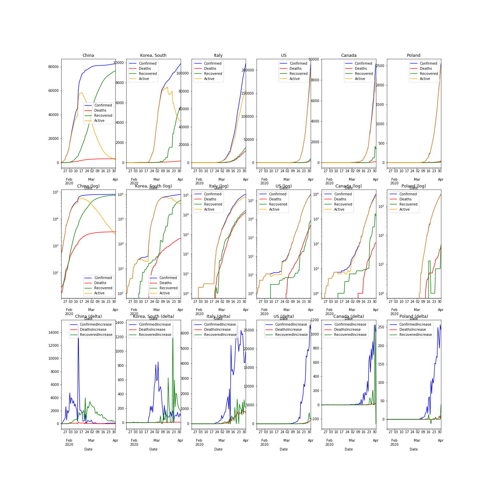
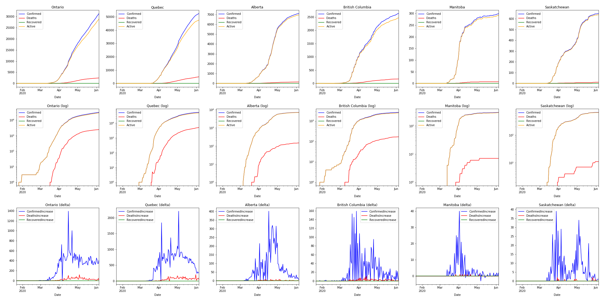
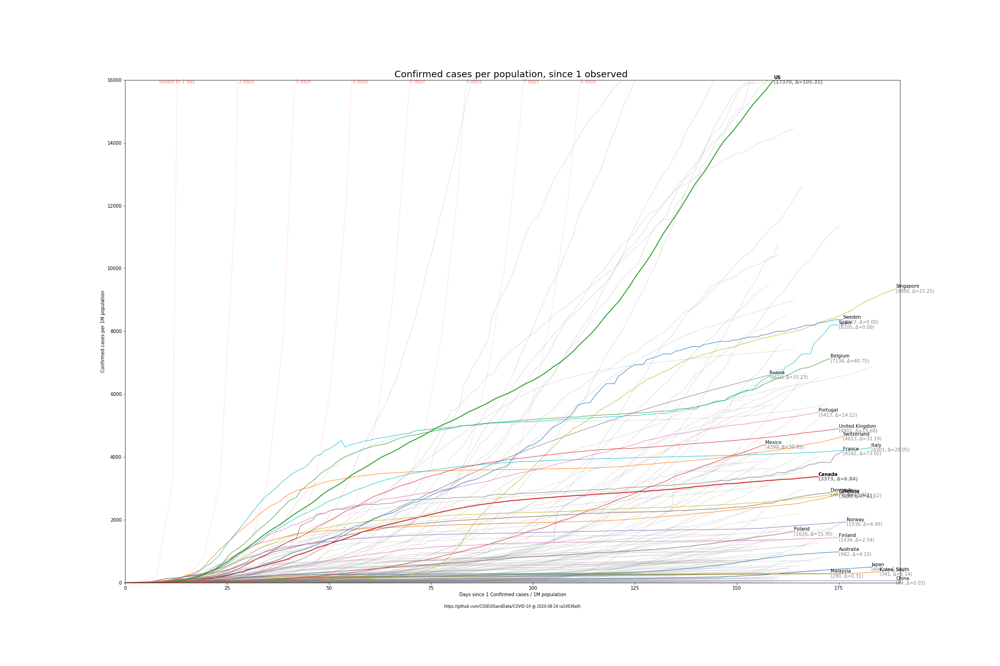
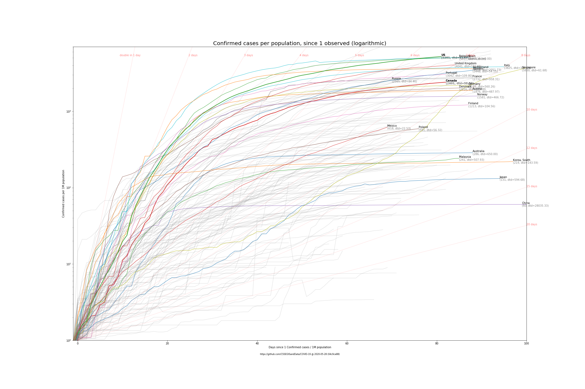
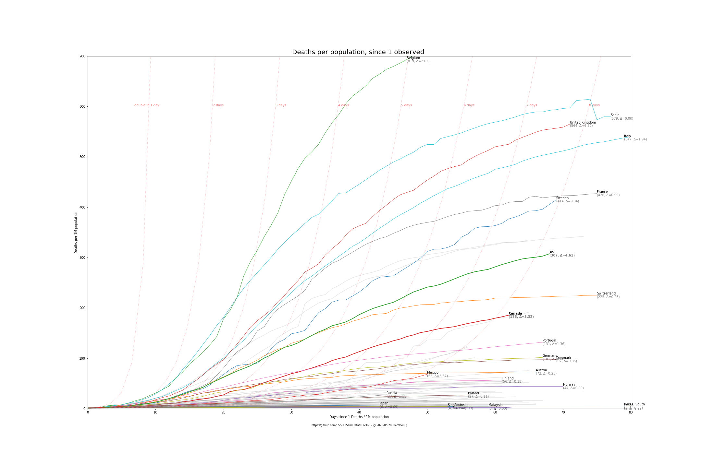
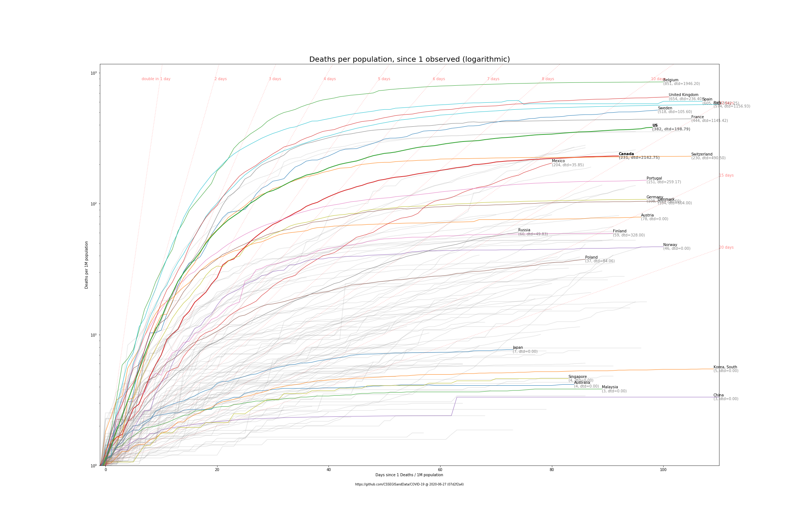

# About

I'm playing around with python/pandas and the COVID-19 dataset.

# Dependencies

Before you load the Jupyter notebook, grab the data set:

    git clone https://github.com/CSSEGISandData/COVID-19

# Results

Comparing some countries...

Looking at Canadian provinces...

Here is how countries are progressing...

